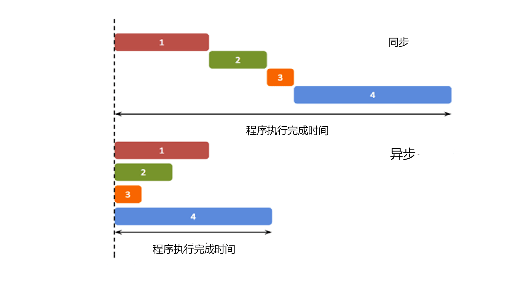

# JavaScript 第一部分
## 异步
异步是指一个函数在运行时，如果遇到耗时的操作，比如网络请求，会先执行其他代码，等耗时的操作完成后，再执行这个函数。

与同步的区别是，同步代码会阻塞浏览器，而异步代码不会。

异步函数的执行效率更高，避免了程序的阻塞，非常适合于io密集型操作

* 举个例子
我们想要泡茶，一共有以下几个步骤（括号内是所需的分钟数）
  - 洗水壶，茶具（1）
  - 烧开水（6）
  - 拿到茶叶（1）
  - 泡茶（4）
怎样泡茶用时最短？



js为单线程，所以无法同时执行同步代码和异步代码，所以需要回调函数来处理异步代码

### 回调函数

回调函数就是一个函数，它是在我们启动一个异步任务的时候就告诉它：等你完成了这个任务之后要干什么。这样一来主线程几乎不用关心异步任务的状态了，他自己会善始善终。

```javascript
setTimeout(() => {
    console.log('烧水');
}, 6000);

console.log("其他步骤");

```
但是
```javascript
setTimeout(() => {
    console.log('等六秒');
    setTimeout(() => {
        console.log('等两秒');
        setTimeout(() => {
            console.log('等四秒');
        },4000)
    },2000)
},6000)
```
第一个完事后，再去回调函数里执行第二个，再执行第三个，再执行第四个，这样，就实现了串行执行，但是，如果嵌套太多，就会很麻烦

这就是前端常说的回调地狱

所以，我们可以使用promise来解决这个问题。

promise是js中处理异步代码的解决方案，它将异步代码封装成一个对象，并提供一系列方法来处理异步任务的状态。

promise对象有3个状态：pending（进行中）、fulfilled（已完成）、rejected（已拒绝）。

promise对象提供了then方法，用于注册回调函数，当promise对象的状态发生变化时，会调用对应的回调函数。

Promise意思就是承诺，这个请求会在未来某个时刻返回结果。

fetch()方法用于发送异步请求，返回一个promise对象。

```javascript
fetch('https://api.example.com/data')
  .then(response => response.json())
  .then(json => console.log(json))


fetch('https://api.example.com/data')
  .then(response => response.json())
    .then(data => {
        console.log(data);
    })
  .catch(error => console.error(error))//如果出错，会调用catch方法，之后的then方法不会执行
   .finally(() => console.log('请求完成'));//无论成功与否，都会执行
```
### async/await

async/await是es7新增的语法，它使得异步代码更加清晰易读。

async/await可以让异步代码看起来像同步代码，但是它其实是一个语法糖，它只是将异步代码封装在函数中，然后通过await关键字等待异步任务的完成。

```javascript
async function fetchData() {
    const response = await fetch('https://api.example.com/data');//await等待请求完成后返回结果
}
fetchData();//返回的永远是promise对象
```
await看起来像是阻塞，但是它其实是异步的，它会等待异步任务的完成，然后再执行后面的代码。等待过程中，js仍然可以执行其他任务

这是因为await是基于Promise和事件循环机制实现的

另外需要注意
```javascript
async function fetchData() {
    [1,2,3].foreach(async (item) =>{
        await somefunction();
    })
    console.log("ok")
}
```
这里的foreach会自动返回，并不会等所有的异步操作执行完毕，而是直接执行后面的代码。

如果我们想都执行完了，我们可以使用for循环，或者使用for await

```javascript
async function fetchData() {
    const promises = [
        somefunction(),
        somefunction(),
        somefunction()
    ];
    for await (const promise of promises) {
        // do something with promise
    };//循环等待每个promise完成后再执行
    console.log("done")
}
```
注意await只能用于async函数中，否则会报错

好，我们来试试写一下泡茶的过程

```javascript
// 定义每个任务所需的时间
const tasks = {
    wash: 1, // 洗水壶，茶具
    boil: 6, // 烧开水
    getTea: 1, // 拿到茶叶
    brew: 4 // 泡茶
  };
  
  // 创建一个异步任务函数
  function asyncTask(name, time) {
    return new Promise((resolve) => {
      setTimeout(() => {
        console.log(`${name} 完成`);
        resolve();
      }, time * 1000); // 将时间转换为毫秒
    });
  }
  
  // 主函数，使用异步处理
  async function makeTea() {
    // 并行执行 "洗水壶，茶具" 和 "拿到茶叶"
    const [washDone, getTeaDone] = await Promise.all([
      asyncTask('洗水壶', tasks.wash),
      asyncTask('拿到茶叶', tasks.getTea)
    ]);
  
    // 串行执行 "烧开水" 和 "泡茶"
    await asyncTask('烧开水', tasks.boil);
    await asyncTask('泡茶', tasks.brew);
  
    console.log('茶做好了');
  }
  
  // 调用主函数
  makeTea();
  
```

## AJAX
AJAX（Asynchronous JavaScript and XML）是web开发中用于创建交互式web应用程序的技术。它允许网页在不重新加载的情况下，与服务器交换数据并更新部分网页。

事件触发（如点击按钮或页面加载）。

AJAX 请求：通过 JavaScript 创建一个 XMLHttpRequest 对象，向服务器发送请求。

服务器处理请求：服务器（通常使用 PHP、Node.js 等）接收请求，处理并返回响应数据（JSON、XML、HTML等）。

AJAX 响应处理：浏览器接收响应，使用 JavaScript 在页面上更新内容，而无需重新加载整个页面。

